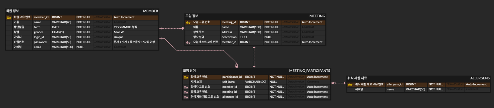

# 우아한유스방 5차 과제 - 모임

## 🔍 ERD

---

## ✏️ 요구사항 정리
1. 회원가입
   - [ ] 회원가입 시 주최자/참여자 중 한가지를 선택한다.
   - [ ] 선택한 회원 종류에 필요한 데이터를 입력받아 저장한다.
   - [ ] 비밀번호 정책은 임의로 정한다. (문자와 숫자가 1개 이상 + 7자리 이상)
2. 로그인
   - [ ] 회원의 아이디와 비밀번호가 일치하면 인증 토큰을 반환한다.
   - [ ] 토큰은 JWT 방식을 사용한다.
3. 회원 정보 수정 (Auth Required)
   - [ ] 본인의 정보만 수정할 수 있다.
   - [ ] 아이디는 고유한 값이므로 변경할 수 없다.
   - [ ] 비밀번호를 수정할 때 정책에 부합하는지 검증한다.
4. 내 정보 조회 (Auth Required)
    - [ ] 비밀번호를 제외한 내 정보를 조회할 수 있다.
    - [ ] 회원 종류가 주최자일 경우 소속 정보, 참여자일 경우 자기소개와 취식 제한 재료 정보가 추가로 조회된다. (둘 다 일 경우 모두 조회)  
5. 기존 회원 주최자/참여자 등록 (Auth Required)
    - [ ] 주최자는 추가 정보를 받아 참여자로도 활동 할 수 있다. (자기소개, 취식 제한 재료)
    - [ ] 참여자는 추가 정보를 받아 주최자로도 활동 할 수 있다. (소속)

---

## 💻 Github 컨벤션

|    타입    |                 설명                 |                  예시                   |
|:--------:|:----------------------------------:|:-------------------------------------:|
|  merge   |              PR merge              |         merge: 백엔드 프로젝트를 생성한다         |
|   feat   |             새로운 기능 추가              |         feat: 사용자 등록 기능을 추가한다         |
|   fix    |               버그 수정                | fix: 예약 시 매장 회원에게 승인 요청이 안가는 오류를 수정한다 |
| refactor |              코드 리팩토링               |    refactor: 예약 비즈니스 로직 리팩토링을 진행한다    |
|   test   |             테스트 코드 작성              |         test: 예약 실패 케이스를 추가한다         |
|   docs   |               문서 수정                |        docs: README에 ERD를 추가한다        |
|  chore   | 빌드 업무, 패키지 매니저 수정 등 (소스 코드 외적인 작업) |          chore: PR 템플릿을 생성한다          |

---
